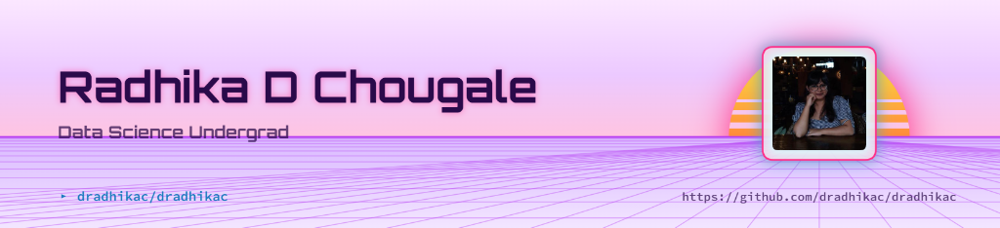

  <picture>
    <source media="(prefers-color-scheme: dark)" srcset="header-dark.png">
    
  </picture>

  

- Passionate about **Generative AI**, **Large Language Models (LLMs)**, **RAG**, and **Agentic AI** with **n8n** automation workflows.
- Strong foundation in **Data Structures & Algorithms**, **Python**, **Java**, **SQL**, and Data Engineering.
- Experienced in Computer Vision (**YOLOv8**, **OpenCV**), Web Apps (**React**, **Node.js**, **Streamlit**), and Databases (**MySQL**, **MongoDB**).
- **Goal:** Engineer production-ready AI products and intelligent data-driven solutions that solve real-world challenges.
- Always curious, building with purpose, and chasing the next idea worth bringing to life.

<h2 align="center">Tech Stack</h2>

  

<h2 align="center">Contribution Graph</h2>

  <picture>
    <source media="(prefers-color-scheme: dark)" srcset="https://raw.githubusercontent.com/dradhikac/dradhikac/output/github-contribution-grid-snake-dark.svg" />
    <source media="(prefers-color-scheme: light)" srcset="https://raw.githubusercontent.com/dradhikac/dradhikac/output/github-contribution-grid-snake.svg" />
    
  </picture>

<h2 align="center">Let's Connect</h2>

  
  &nbsp;
  

  See you in the next commit

  

