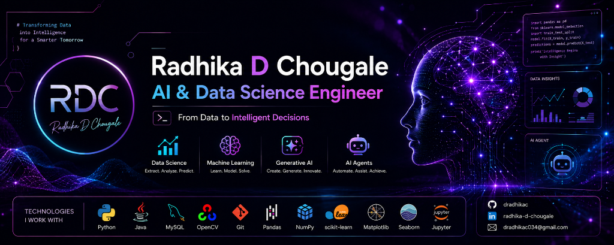

  

  

  

## 👋 About Me

🎓 **Data Science Student**

🧠 **Building AI Products**

🚀 **Interested in**

• Machine Learning  
• LLMs  
• Computer Vision  
• AI Agents  
• Data Engineering  
• MLOps  

💡 **Goal**  
Build AI systems used by millions.

---

### 🛠️ Tech Stack & Tools

  

  
  
  
  
  
  
  

---

### 📊 GitHub Stats

  
  

---

### 🐍 Contribution Snake

  <picture>
    <source media="(prefers-color-scheme: dark)" srcset="https://raw.githubusercontent.com/dradhikac/dradhikac/output/github-contribution-grid-snake-dark.svg" />
    <source media="(prefers-color-scheme: light)" srcset="https://raw.githubusercontent.com/dradhikac/dradhikac/output/github-contribution-grid-snake.svg" />
    
  </picture>

---

### 🌐 Connect with Me

  
  &nbsp;
  
  &nbsp;
  

  

